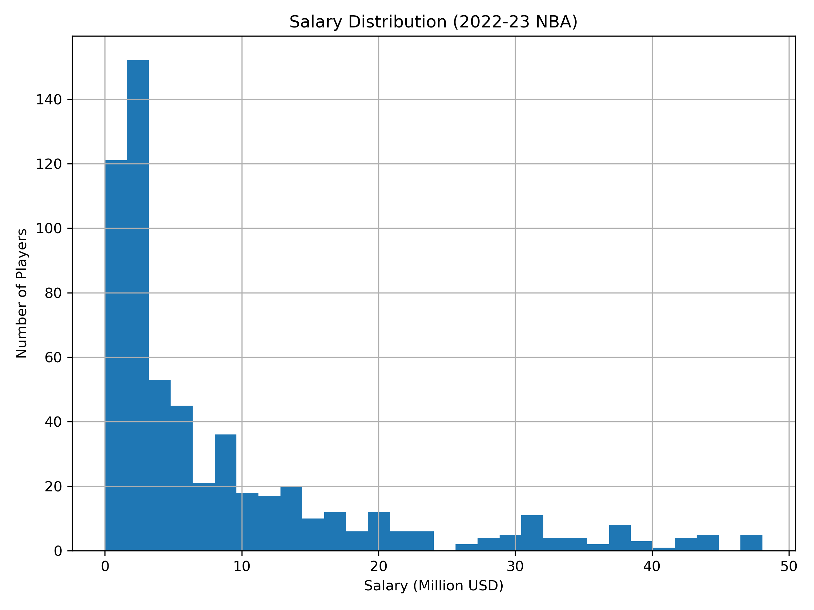
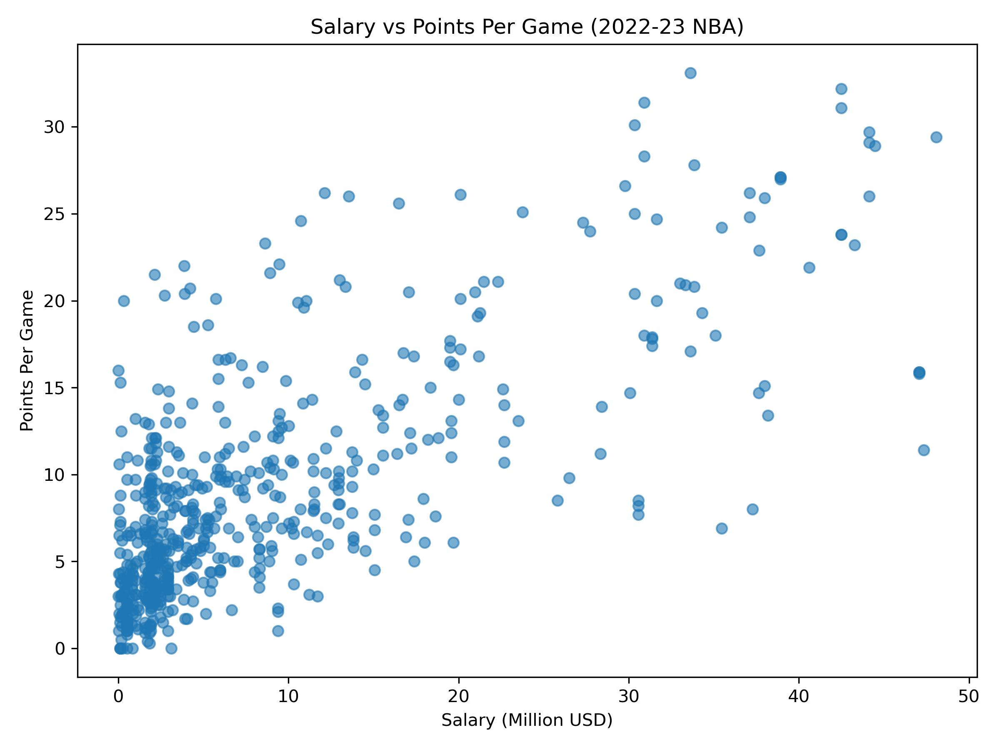
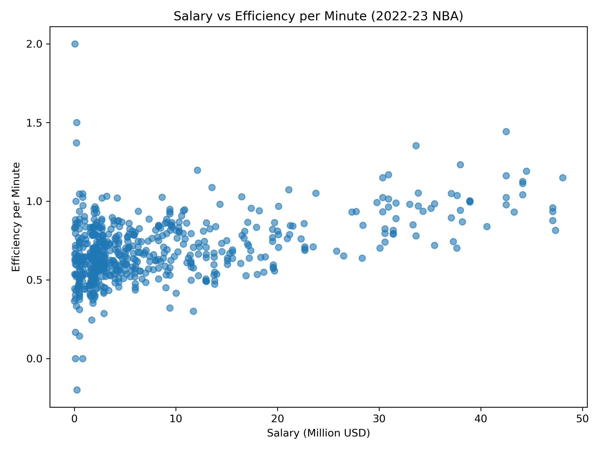
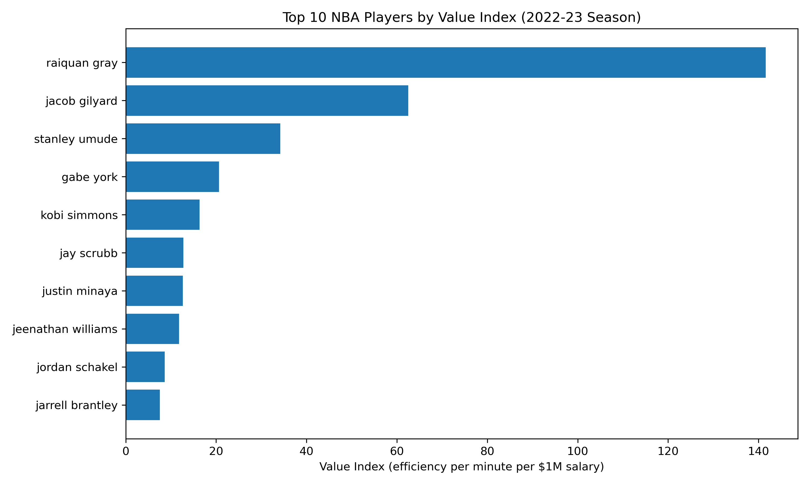
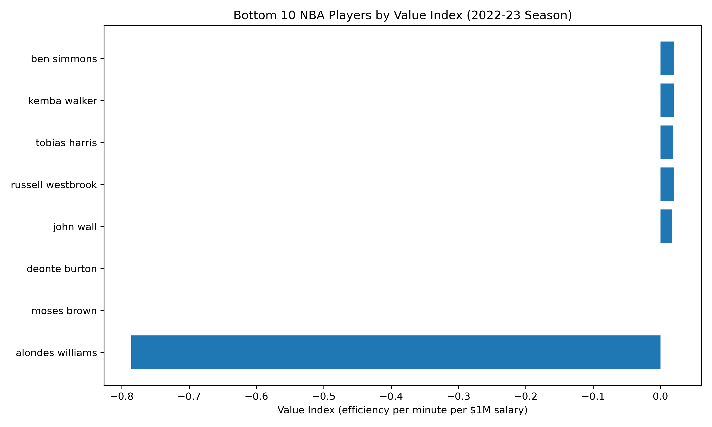
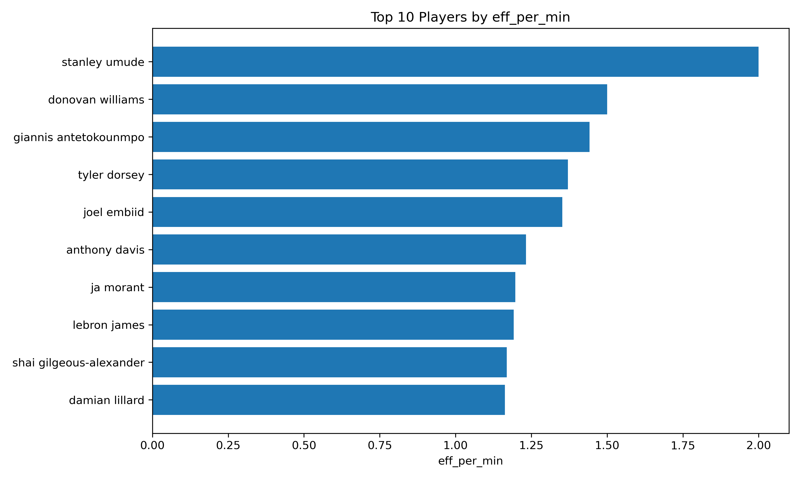
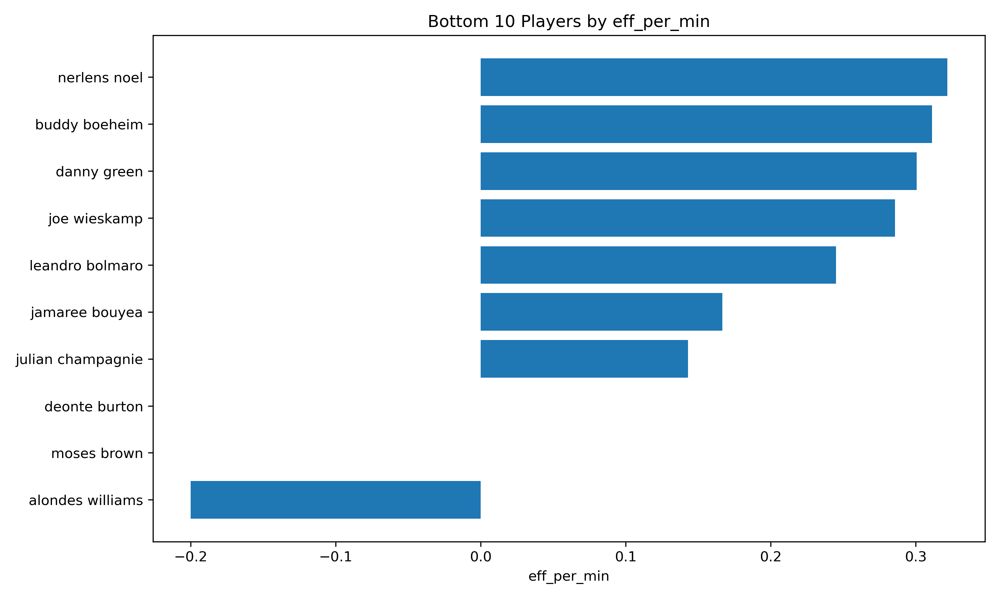
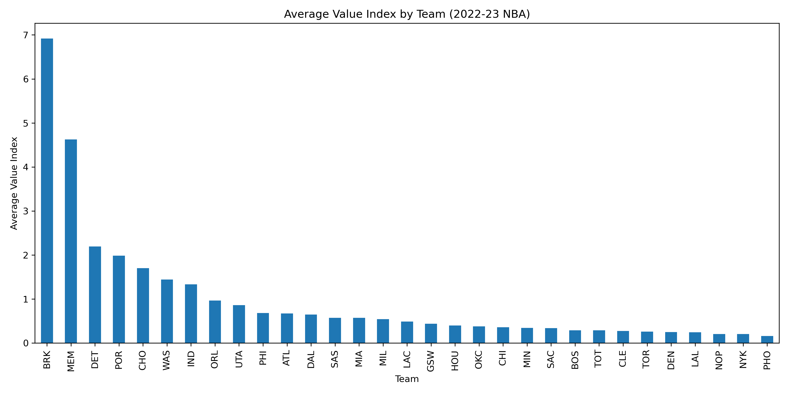

# NBA Salary–Performance Analysis (2022–2023 Season)

---

## Contributors
- **Jezzy Jia (ziyijia2)** — Data acquisition, licensing review, OpenRefine cleaning, name normalization, integration workflow design  
- **Logan Li (jiajun7)** — Feature engineering, exploratory/statistical analysis, visualization design, automated pipeline (run_all.ipynb), documentation

---

## 1. Summary

This project examines the relationship between NBA player salaries and on-court performance during the 2022–2023 regular season through a comprehensive, fully reproducible data curation and analysis pipeline. The work is motivated by ongoing debates in sports analytics and labor economics regarding whether player compensation accurately reflects real-time productivity, or whether structural, contractual, and contextual factors produce measurable distortions in salary allocation. By integrating independently authored datasets from Kaggle and applying rigorous data cleaning, normalization, and feature engineering procedures, this project provides an empirical foundation for quantifying player value and exploring the extent to which salary corresponds to actual performance outcomes.

### Research Motivation

NBA player salaries are determined through a mixture of collective bargaining agreements, multi-year contract structures, historical performance, perceived market value, and team-specific strategic considerations. Consequently, salary is not always a direct reflection of a player's current-season impact. Veterans signed under previous contract conditions may be overcompensated in later years, while rookies and minimum-salary contributors may generate substantial value at low cost. The objective of this project is to examine these patterns within a single season using reproducible, data-driven methods.

Our central research question is:

**Is there a measurable relationship between NBA player salaries and on-court performance during the 2022–2023 season?**

To operationalize this question, we analyze both raw performance metrics and several derived efficiency and value measures. These include per-minute efficiency, scoring efficiency, composite efficiency indices, and salary-normalized value metrics. By comparing salary to both traditional and derived measures, we aim to identify which kinds of performance indicators correlate most strongly with compensation and which players appear misaligned with market expectations.

### Dataset Overview

This project integrates two independent datasets. The performance dataset is licensed under CC BY 4.0, permitting redistribution, and is included in the repository under `data/raw/performance_2022_2023.csv`. The salary dataset is governed by Kaggle’s “Other” license, which provides no explicit redistribution rights. To comply with IS477 Module 2 licensing requirements, the raw salary dataset is not included in this repository. Instead, we provide a link to the original Kaggle source and instructions for users to download it manually. The cleaned salary information, derived metrics, and integrated datasets are legally shareable and are included in the repository.

### Data Curation and Cleaning

Because the datasets originate from different sources and lack a common player identifier, extensive cleaning and normalization were required to enable accurate integration. We used OpenRefine to standardize player names, remove punctuation and spacing inconsistencies, and cluster variations such as “A.J. Lawson” versus “AJ Lawson.” All OpenRefine transformations are preserved in the JSON histories located in:

data/cleaned_data/Performance_history.json
data/cleaned_data/salaries_history.json

Additional data curation steps included converting salary fields from currency-formatted strings to numeric values, filtering salary entries to the 2022–2023 season, and removing irrelevant or malformed rows. On the performance dataset, players traded mid-season appeared multiple times; to avoid double-counting or inconsistent statistics, we applied a deterministic rule retaining the row corresponding to the team for which the player logged the most games.

### Integration and Enrichment

After cleaning, we integrated the datasets using standardized player names as the join key. This produced a unified table (`merged_salary_stats.csv`) that aligns each player’s performance profile with their corresponding salary. From this merged data, we engineered several analytic variables designed to quantify efficiency and value.

Key derived metrics include:

- **efficiency_index**: a composite productivity measure calculated as points plus rebounds plus assists  
- **eff_per_min**: productivity normalized by minutes played  
- **salary_million**: salary expressed in millions for interpretability  
- **value_index**: a ratio of efficiency per minute to salary per million, used to assess value generation  

The final feature-enhanced analytic dataset (`final_dataset.csv`) contains 36 variables and is documented in the accompanying `Data_Dictionary.md`.

### Analytical Workflow

Our analyses evaluate both simple and composite relationships between salary and performance. We examine correlations between salary and points per game, efficiency per minute, composite performance indices, and salary-normalized value measures. Visualizations include salary distributions, salary-performance scatterplots, and bar charts highlighting the top and bottom performers in value_index and efficiency indices. All plots are generated automatically through the workflow pipeline and stored in:

run_all/plots/

### Workflow Automation and Reproducibility

To ensure reproducibility, our end-to-end analysis pipeline is encapsulated in `run_all.ipynb`. This notebook performs raw data loading, cleaning, integration, feature engineering, and visualization generation. The final analytic outputs, including merged datasets and plots, are also provided in a Box folder per course requirements:

https://uofi.app.box.com/folder/354747066623

### Summary Conclusion

The Summary section of this project demonstrates the full alignment of our workflow with IS477’s emphasis on data ethics, licensing compliance, transparent cleaning, structured integration, reproducibility, and rigorous exploratory analysis. The investigation ultimately provides a data-grounded perspective on the salary–performance relationship in the NBA, revealing measurable gaps between compensation and on-court impact. The sections that follow elaborate on dataset profiles, quality assessments, analytic findings, and future work.

## 2. Data Profile

This project uses two independently authored datasets sourced from Kaggle: one containing detailed NBA player performance statistics for the 2022–2023 regular season and another containing multi-season salary information. Because the datasets originate from different authors, formats, and licensing schemes, they require careful assessment before cleaning, integration, and analysis. This section provides a comprehensive description of each dataset, its licensing constraints, structural characteristics, and the rationale guiding our curation decisions. The goal is to document not only what the data contains but also how its structure, permissions, and limitations shape the analytical workflow.

### Dataset 1: NBA Player Performance (2022–2023)

**Source:**  
https://www.kaggle.com/datasets/bryanchungweather/nba-players-data-2022-2023  

**License:**  
Creative Commons Attribution 4.0 (CC BY 4.0) – redistribution permitted.

**Storage Location in Repository:**  
`data/raw/performance_2022_2023.csv`

This dataset provides a comprehensive record of per-game performance statistics for players in the 2022–2023 NBA season. It includes variables describing scoring performance, shooting efficiency, playmaking, defensive contributions, and playing time. The dataset is relatively clean and structurally consistent, making it suitable as the foundational performance dataset in our analysis.

#### Key Attributes and Schema Highlights

The dataset includes the following categories of fields:

- **Basic player identifiers**: name, position, age, team abbreviation  
- **Game participation**: games played, games started, minutes per game  
- **Scoring and shooting metrics**: field goals, three-point shooting, two-point shooting, free throws, shot attempts, and corresponding percentages  
- **Advanced efficiency metrics**: effective field goal percentage  
- **Rebounding and playmaking**: offensive rebounds, defensive rebounds, assists  
- **Defensive activity**: steals, blocks  
- **Possession-related metrics**: turnovers, personal fouls  
- **Aggregate productivity**: points per game  

Although the dataset is mostly consistent, profiling identified several issues that needed to be addressed prior to integration:

- **Players traded mid-season** appear multiple times, each row tied to a different team.  
- **Missing shooting percentages** occur for players who attempted zero shots in a category.  
- **Variation in formatting** for player names, including punctuation and spacing differences.  
- **Potential schema misalignment** with the salary dataset due to inconsistent naming conventions.

### Ethical and Licensing Considerations

Because the dataset is licensed under CC BY 4.0, redistribution is legally permissible as long as proper attribution is maintained. The dataset contains no personal or sensitive information; all fields correspond to publicly available sports statistics. As a result, the performance dataset is included directly within the repository.

### Dataset 2: NBA Salaries (Multi-Season Dataset)

**Source:**  
https://www.kaggle.com/datasets/omarsobhy14/nba-players-salaries  

**License:**  
Kaggle “Other” License – no redistribution permitted.

**Required Local Storage Path (Not Included in Repo):**  
`data/raw/salaries.csv`

This dataset provides salary values for NBA players across multiple seasons. It requires substantial cleaning and restructuring to isolate the salaries relevant to the 2022–2023 season. The dataset cannot be redistributed in raw form, so users must download it manually following the instructions in this README. All derived outputs, aggregated data, and visualizations built from the salary data are permissible to share.

#### Structural and Content Characteristics

The salary dataset includes:

- **Player name** (not standardized across datasets)  
- **Salary fields for multiple seasons**, requiring filtering  
- **Contract values expressed as formatted currency strings**, such as "$34,250,000"  
- **Incomplete or missing salary rows** for certain players  
- **Multiple naming formats** including punctuation, initials, and suffixes  

Due to these varying structures, the dataset required significantly more preprocessing than the performance dataset.

### Legal and Ethical Constraints

Because the dataset does not specify licensing terms permitting redistribution, IS477 guidelines classify it as restricted. Following these principles:

- The raw salary dataset is **not included** in GitHub.  
- The dataset is **not uploaded** to the Box folder.  
- We instead provide:  
  - A link to the Kaggle download page  
  - Instructions for placing the dataset in the correct directory  
  - Only derived output files generated through cleaning and transformation  

This ensures full legal compliance.

### Integration Dataset and Post-Cleaning Structure

After cleaning the independent datasets using a combination of OpenRefine and Python transformations, we merged them into a unified dataset. This merged dataset aligns each player's performance metrics with their 2022–2023 salary information. The merged and enriched datasets are stored at:

- `data/merged_data/merged_salary_stats.csv`  
- `nba_salary_value_analysis/data/processed/final_dataset.csv`  

The final dataset includes 36 variables, combining raw performance metrics, cleaned salary values, and engineered features. This dataset serves as the foundation for the analytical components of the project.

### Documentation and Metadata

To facilitate transparency and reproducibility, we provide:

- **OpenRefine operation histories** documenting all cleaning steps:  
  - `data/cleaned_data/Performance_history.json`  
  - `data/cleaned_data/salaries_history.json`  

- **A detailed Data Dictionary** describing each variable in the final dataset:  
  `Data_Dictionary.md`

This metadata ensures that every transformation, filter, and derivation is traceable and reproducible.

### Summary

The two datasets used in this study differ significantly in schema, licensing, structure, and data quality. The performance dataset is relatively clean and fully redistributed, while the salary dataset contains the majority of the complexity in terms of licensing restrictions, formatting inconsistencies, and structural noise. This section documents the careful data profiling and compliance-based handling necessary to prepare both datasets for integration. Together, they form a robust and ethically curated foundation for investigating the salary–performance relationship in the NBA.

## 3. Data Quality Assessment

A rigorous data quality assessment is essential for ensuring that the integrated dataset accurately represents the 2022–2023 NBA season and supports valid analytical conclusions. Because the performance and salary datasets originate from separate authors and contain different schema conventions, formatting practices, and error patterns, substantial inspection and remediation were necessary before meaningful integration could occur. This section documents the primary data quality issues identified during profiling, the risks these issues pose for analysis, and the cleaning and validation measures taken to resolve them. All practices reflect IS477’s expectations for transparency, traceability, and reproducibility in data curation.

### Overview of Quality Challenges

The two datasets differ in several critical ways:

- They have **no shared unique identifier**, requiring name-based merging.  
- They exhibit **different naming conventions**, including punctuation, spacing, capitalization, and special characters.  
- The salary dataset contains **currency formatting inconsistencies**, missing values, and multiple rows per player across multiple seasons.  
- The performance dataset includes **duplicated players** due to mid-season trades.  
- Each dataset exhibits **distinct patterns of missingness**.  
- The salary dataset is governed by a restrictive license, constraining how its content may be used and redistributed.

These differences necessitated a comprehensive, multi-stage quality assessment process.

### Quality Assessment of the Performance Dataset

The performance dataset is structurally consistent but contains several quality concerns:

#### Duplicate Player Entries from Trades

Because NBA players may be traded during a season, the dataset includes multiple rows for such players. Without correction, this duplication could distort statistical summaries and produce incorrect matches during integration.

**Observed patterns:**
- Players appear under multiple teams with varying games played.  
- Aggregate performance metrics differ across rows, complicating selection.

**Resolution strategy:**
- Implemented a deterministic rule: retain the row corresponding to the team for which the player recorded the most games played.  
- Ensures a consistent one-row-per-player structure.

#### Missing or Zero-Value Fields

Some players show missing values in metrics such as shooting percentages when no attempts were made.

**Relevance:** Missing values propagate errors into derived efficiency calculations.

**Resolution:**
- Replaced missing percentage fields with zero in cases where attempts equal zero.  
- This approach aligns with statistical conventions and prevents division-by-zero errors.

#### Name Inconsistencies

Player names may include periods, suffixes, hyphens, or inconsistent capitalization.

**Risks:**
- Failed merges  
- Incorrect matches  
- Inflated unmatched-player counts

**Resolution:**
- Applied OpenRefine clustering (key collision and nearest-neighbor) to normalize name formatting.  
- All transformations documented in `Performance_history.json`.

### Quality Assessment of the Salary Dataset

The salary dataset required substantially more cleaning due to formatting inconsistencies, incomplete entries, and multi-year structure.

#### Currency Formatting Errors

Salary entries such as "$34,250,000" must be converted into numeric form for analysis.

**Observed inconsistencies:**
- Presence of commas, dollar signs, and whitespace  
- Occasional missing or improperly formatted entries  

**Resolution:**
- Removed non-numeric characters and converted all values into integers.  
- Standardized numeric salary field included in final datasets.

#### Multi-Season Schema Complexity

The dataset spans multiple seasons, and only 2022–2023 values are relevant.

**Risks:**
- Misalignment between salary season and performance season  
- Inclusion of outdated or irrelevant information  

**Resolution:**
- Filtered dataset to retain only entries for the 2022–2023 season.  
- Dropped unused fields to reduce noise and facilitate integration.

#### Missing Salary Entries

A subset of players lacked salary data entirely.

**Resolution:**
- These players were excluded from analyses requiring salary metrics.  
- Documented the exclusion rationale for transparency.

#### Name Mismatches with Performance Dataset

The salary dataset exhibited inconsistent naming patterns (e.g., punctuation differences, initials, hyphenation).

**Resolution:**
- Applied OpenRefine clustering and manual review using `salaries_history.json`.  
- Ensured alignment with the cleaned names from the performance dataset.

### Integration-Level Quality Assessment

The integration stage carries significant quality risks, given the absence of a shared identifier.

#### Risk: Merge Errors Due to Name-Based Keys

Even after cleaning, small inconsistencies could cause:
- False negatives (missed matches)  
- False positives (incorrect matches)  

**Mitigation:**
- Iterative matching diagnostics verifying one-to-one alignment  
- Manual inspection of mismatched names  
- Verification using summary counts before and after merging

#### Risk: Non-Overlapping Records

Some players exist in only one dataset (e.g., two-way players without recorded salaries or performance data).

**Resolution:**
- These players were logged and excluded from analyses requiring both salary and performance variables.

### Validation of Derived Variables

After integration, we assessed the integrity of derived features such as:
- efficiency_index  
- eff_per_min  
- salary_million  
- value_index  

Validation steps included:
- Checking for division-by-zero errors  
- Testing for outlier inflation  
- Ensuring monotonicity of numeric transformations  

### Documentation and Provenance

All cleaning steps are documented through:
- OpenRefine JSON histories  
- Python code in cleaning and integration cells of `run_all.ipynb`  
- Stored intermediate datasets (`merged_salary_stats.csv`, `final_dataset.csv`)

This ensures full reproducibility and compliance with IS477 transparency standards.

### Summary

The data quality assessment revealed several structural, semantic, and licensing-related challenges requiring extensive cleaning and validation. Through systematic normalization, careful filtering, deterministic row-selection strategies, and rigorous name reconciliation, we ensured that the integrated dataset accurately reflects player performance and salary conditions for the 2022–2023 season. The resulting dataset is both analytically robust and fully reproducible, forming a strong foundation for the findings presented in later sections.

## 4. Findings

The integrated dataset and derived metrics enable an empirical examination of the relationship between salary and performance during the 2022–2023 NBA season. Our findings draw from both numerical analyses and visualizations generated through the automated workflow. The figures embedded in this section illustrate the distribution of salaries, the relationship strength between compensation and various performance metrics, and the identification of unusually undervalued or overvalued players based on efficiency-adjusted value measures.

### Salary Distribution

The salary distribution for the 2022–2023 season is heavily right-skewed, with a small number of players earning more than 30 million dollars and a large number clustered near the league minimum. This imbalance influences the correlation structure between salary and performance because a significant population of low-salary players exhibit highly variable productivity.

The distribution indicates that most players fall within the 1–8 million dollar range, while max-level contracts produce long tails. These properties highlight the need for normalization when evaluating value metrics.

### Salary and Scoring Production

A key question is whether higher salary corresponds to increased scoring output. Figure 2 demonstrates a moderate positive correlation between salary and points per game. Although high-salary players tend to score more, substantial variance exists, particularly among role players and emerging contributors on rookie contracts.

Players earning under 5 million dollars appear across a broad range of scoring outputs, showing that salary alone does not fully capture offensive productivity. The correlation is present but far from determinative.

### Salary and Efficiency Metrics

We next examine per-minute efficiency, a composite index derived from points, rebounds, and assists normalized by minutes played. This measure provides a more holistic perspective on productivity that accounts for opportunity and role.

The relationship between salary and efficiency per minute is noticeably weaker compared to scoring. High-salary players do not consistently produce superior per-minute efficiency, indicating that salary may reward role prominence or historical reputation rather than current-season efficiency.

### Identification of High-Value Players

To evaluate performance relative to salary, we computed a value_index defined as efficiency per minute divided by salary in millions. This metric identifies players who generate significant production relative to their cost.

The top value_index performers are predominantly players on rookie-scale contracts or minimum-salary deals. These findings suggest that younger players and undervalued role contributors provide disproportionate returns per dollar spent.

### Identification of Low-Value Players

Conversely, several high-salary veterans produced low efficiency relative to their compensation. This often results from reduced playing time due to injuries, age-related decline, or mismatches between contract timing and current-season performance.

The presence of multiple high-salary players in the lower tier reinforces the observation that salary structures do not uniformly reflect present-day productivity.

### Additional Efficiency Perspectives

To further contextualize value relative to playing time, we examined top and bottom performers in pure efficiency-per-minute terms.

These charts reveal that several highly efficient players do not have correspondingly high salaries, further demonstrating contract lag and market inefficiency.

### Team-Level Insights

To assess whether certain teams systematically outperform or underperform the league in terms of salary efficiency, we computed the average value_index at the team level.

Teams such as Brooklyn and Memphis exhibited significantly above-average salary value efficiency, while several high-payroll contenders ranked lower. This suggests that roster construction strategies and development pipelines play substantial roles in determining salary efficiency.

### Summary of Findings

Overall, the findings show that while salary exhibits a moderate positive relationship with scoring, its correlation with broader efficiency measures is weak. Value-based metrics consistently identify low-salary players as the highest contributors per dollar spent, while several high-salary veterans produce relatively low returns. These results underscore the incomplete alignment between NBA salaries and on-court productivity and highlight the usefulness of efficiency-normalized value measures for understanding contract performance.
